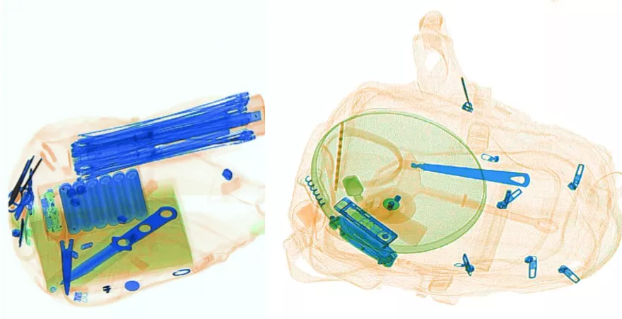
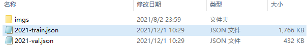
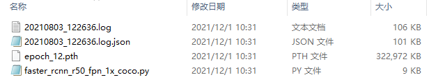
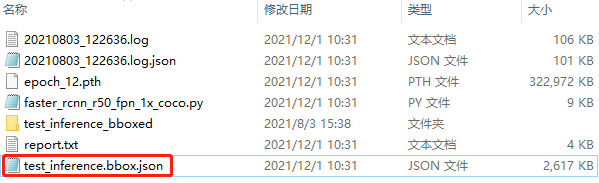
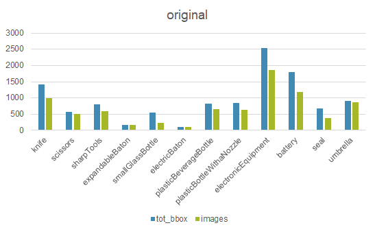

# 2021科大讯飞--X光安检图像识别挑战赛实践

### 一、赛事介绍

​		X光安检机是目前我国使用最广泛的安检技术手段，广泛应用于城市轨交、铁路、机场、重点场馆、物流寄递等场景。使用人工智能技术，辅助一线安检员进行X光安检判图，可以有效降低因为人员疲劳或注意力不集中带来的漏报等问题。但在实际场景中，因物品的多样性、成像角度、遮挡等问题，为算法的开发带来了一定的挑战。




赛题链接：http://challenge.xfyun.cn/topic/info?type=Xray-2021


### 二、赛题内容及分析

#### 1. 赛题内容

**赛题数据组成**

- 初赛：

  1）**带标注**的训练数据，即待识别物品在包裹中的X光图像及其标注文件；

  2）**不带标注**的测试数据；

- 复赛：

  1）**无标注**训练数据即包裹X光图像（其中有的包裹包含**待识别物品**）；

  2）部分**待识别物品**X光图像（无背景）；

- 目标类别：

  刀、剪刀、尖锐工具、甩棍、小玻璃瓶、电棍、塑料饮料瓶、带喷嘴塑料瓶、电子设备、电池、公章、伞， 共12类。

**模型评价指标**

wAP50，即各个类别的AP50按照权重进行加权的结果。

其中各类别权重为：

刀1、剪刀1、尖锐工具1、甩棍1、小玻璃瓶1、电棍1、塑料饮料瓶0.7、带喷嘴塑料瓶0.7、电子设备0.7、电池0.7、公章0.7、伞0.7。

**模型大小**

600M以内

#### 2. 赛题分析

- 赛题数据中，提供了大量的无标注数据，利用好这些无标注数据进行半监督学习是关键。
- 数据可视化发现数据背景较复杂且差异较大，设计合适的数据增强方法是关键。
- 模型评价指标为AP50，因此更关注于模型的分类效果。
- 在模型大小范围内，允许进行一定的模型融合。


### 三、baseline实践

​		本次baseline实践在openmmlab开源的mmdetection目标检测框架上进行。

​		实践环境：mmdetection v2.17，其他相关依赖可依据官方文档配置。

​		具体见GitHub链接：https://github.com/open-mmlab/mmdetection

#### 	3.1 数据处理及可视化

​        **数据处理**

​		为了适用于mmdetection框架，数据已经经过初步处理，主要是1)划分数据集，2)制作标注文件。处理后的数据路径：mmdetection/work_dirs/datasets/，如图所示：



​		**数据可视化**

​		可以自行依据处理后的标注文件绘制bbox信息，或者使用mmdetection/tool/plot_bbox脚本。

```python
plot_bbox --images img_dir  --json annotation_file --out save_dir
```

可视化示例：


#### 3.2 baseline模型参数配置

​		本次实践内容以fasterrcnn_fpn检测模型作为baseline，配置文件见：mmdetection/work_dirs/configs/faster_rcnn_r50_fpn_1x_coco.py

​		配置文件介绍：

​		**(a) 模型结构**

​		这部分配置内容体现了模型的基本框架，如果需要更改模型内容，比如anchor设置、替换backbone、loss函数等，需要在此处进行相关配置的改动，否则使用默认配置即可。

```python
# model settings
model = dict(
    type='FasterRCNN',	
    backbone=dict(
        type='ResNet',
        depth=50,
        num_stages=4,
        out_indices=(0, 1, 2, 3),
        frozen_stages=1,
        norm_cfg=dict(type='BN', requires_grad=True),
        norm_eval=True,
        style='pytorch',
        init_cfg=dict(
            type='Pretrained', 
            checkpoint='./resnet50-19c8e357.pth')),
    neck=dict(
        type='FPN',
        in_channels=[256, 512, 1024, 2048],
        out_channels=256,
        num_outs=5),
    rpn_head=dict(
        type='RPNHead',
        in_channels=256,
        feat_channels=256,
        anchor_generator=dict(
            type='AnchorGenerator',
            scales=[8],
            ratios=[0.5, 1.0, 2.0],
            strides=[4, 8, 16, 32, 64]),
        bbox_coder=dict(
            type='DeltaXYWHBBoxCoder',
            target_means=[.0, .0, .0, .0],
            target_stds=[1.0, 1.0, 1.0, 1.0]),
        loss_cls=dict(
            type='CrossEntropyLoss', use_sigmoid=True, loss_weight=1.0),
        loss_bbox=dict(type='L1Loss', loss_weight=1.0)),
    roi_head=dict(
        type='StandardRoIHead',
        bbox_roi_extractor=dict(
            type='SingleRoIExtractor',
            roi_layer=dict(type='RoIAlign', output_size=7, sampling_ratio=0),
            out_channels=256,
            featmap_strides=[4, 8, 16, 32]),
        bbox_head=dict(
            type='Shared2FCBBoxHead',
            in_channels=256,
            fc_out_channels=1024,
            roi_feat_size=7,
            num_classes=12,
            bbox_coder=dict(
                type='DeltaXYWHBBoxCoder',
                target_means=[0., 0., 0., 0.],
                target_stds=[0.1, 0.1, 0.2, 0.2]),
            reg_class_agnostic=False,
            loss_cls=dict(
                type='CrossEntropyLoss', use_sigmoid=False, loss_weight=1.0),
            loss_bbox=dict(type='L1Loss', loss_weight=1.0))),
```

​		**(b) 训练及测试模型配置**

​		这部分配置文件内容主要为训练和测试的相关参数配置，如训练时rpn及rcnn正负样本采样阈值、采样策略，测试时nms选择策略等。也可以根据需要进行相应调整。

```python
 # model training and testing settings
    train_cfg=dict(
        rpn=dict(
            assigner=dict(
                type='MaxIoUAssigner',
                pos_iou_thr=0.7,
                neg_iou_thr=0.3,
                min_pos_iou=0.3,
                match_low_quality=True,
                ignore_iof_thr=-1),
            sampler=dict(
                type='RandomSampler',
                num=256,
                pos_fraction=0.5,
                neg_pos_ub=-1,
                add_gt_as_proposals=False),
            allowed_border=-1,
            pos_weight=-1,
            debug=False),
        rpn_proposal=dict(
            nms_pre=2000,
            max_per_img=1000,
            nms=dict(type='nms', iou_threshold=0.7),
            min_bbox_size=0),
        rcnn=dict(
            assigner=dict(
                type='MaxIoUAssigner',
                pos_iou_thr=0.5,
                neg_iou_thr=0.5,
                min_pos_iou=0.5,
                match_low_quality=False,
                ignore_iof_thr=-1),
            sampler=dict(
                type='RandomSampler',
                num=512,
                pos_fraction=0.25,
                neg_pos_ub=-1,
                add_gt_as_proposals=True),
            pos_weight=-1,
            debug=False)),
    test_cfg=dict(
        rpn=dict(
            nms_pre=1000,
            max_per_img=1000,
            nms=dict(type='nms', iou_threshold=0.7),
            min_bbox_size=0),
        rcnn=dict(
            score_thr=0.05,
            nms=dict(type='nms', iou_threshold=0.5),
            max_per_img=100)
        )
```

​		**(c) 数据处理**

​		这部分配置内容主要为数据加载、数据预处理相关内容的设置，除了正常的数据加载、归一化等操作，比较关键的就是一些在线数据增强操作也要体现在这个地方。

```python
# dataset settings
dataset_type = 'IflyDataset'	#自定义数据类
img_norm_cfg = dict(
    mean=[123.675, 116.28, 103.53], std=[58.395, 57.12, 57.375], to_rgb=True)
train_pipeline = [
    dict(type='LoadImageFromFile'),
    dict(type='LoadAnnotations', with_bbox=True),
    dict(type='Resize', img_scale=(1333, 800), keep_ratio=True),
    dict(type='RandomFlip', flip_ratio=0.5),
    dict(type='Normalize', **img_norm_cfg),
    dict(type='Pad', size_divisor=32),
    dict(type='DefaultFormatBundle'),
    dict(type='Collect', keys=['img', 'gt_bboxes', 'gt_labels']),
]
test_pipeline = [
    dict(type='LoadImageFromFile'),
    dict(
        type='MultiScaleFlipAug',
        img_scale=(1333, 800),
        flip=False,
        transforms=[
            dict(type='Resize', keep_ratio=True),
            dict(type='RandomFlip'),
            dict(type='Normalize', **img_norm_cfg),
            dict(type='Pad', size_divisor=32),
            dict(type='ImageToTensor', keys=['img']),
            dict(type='Collect', keys=['img']),
        ])
]
```

​		**(d) 数据配置**

​		炼丹师需要在这部分来指定训练、验证、测试阶段图片路径以及标注信息路径，以及前面定义的数据处理pipeline。训练时，会根据ann_file中的图片名称去img_prefix中寻找图片并加载到模型中训练，所以训练和测试的img_prefix可以一样，把ann_file区别开就可以。

```python
data = dict(
    samples_per_gpu=2,
    workers_per_gpu=2,
    train=dict(
        type=dataset_type,
        ann_file='./work_dirs/datasets/2021-train.json',
        img_prefix='./work_dirs/datasets/imgs',
        pipeline=train_pipeline),
    val=dict(
        type=dataset_type,
        ann_file='./work_dirs/datasets/2021-val.json',
        img_prefix='./work_dirs/datasets/imgs',
        pipeline=test_pipeline),
    test=dict(
        type=dataset_type,
        ann_file='./work_dirs/datasets/2021-val.json',
        img_prefix='./work_dirs/datasets/imgs',
        pipeline=test_pipeline))
```

​		**（e) 其他配置**

​		这部分内容比较杂，但是比较重要，会常需要改动。代码中备注一些重要的信息含义。

```python
evaluation = dict(interval=6, metric='bbox')		#设置训练时在测试集上推理的频次以及指标计算方式

optimizer = dict(type='SGD', lr=0.0015, momentum=0.9, weight_decay=0.0001)	#优化器设置、学习率设置
optimizer_config = dict(grad_clip=None)
lr_config = dict(
    policy='step',		#学习率衰减策略设置
    warmup='linear',
    warmup_iters=500,
    warmup_ratio=0.001,
    step=[8, 11])
runner = dict(type='EpochBasedRunner', max_epochs=12)	#训练总epoch次数设置

checkpoint_config = dict(interval=1)	#权重文件保存频次设置
log_config = dict(
    interval=50,	#每训练50batch数据打印一次日志
    hooks=[
        dict(type='TextLoggerHook'),
        # dict(type='TensorboardLoggerHook')
    ])
custom_hooks = [dict(type='NumClassCheckHook')]
dist_params = dict(backend='nccl')
log_level = 'INFO'
load_from = None	#加载预训练模型
resume_from = None	#模型训练中断，需要接着训练时，可传入某epoch的权重，模型会接着训练
workflow = [('train', 1)]
```

​		

#### 3.3  自定义数据类型设置

​		鉴于我们使用的是非coco官方数据，因此需要自行配置数据相关信息。

​		在mmdetection/mmdet/datasets/coco.py下，自定义IflyDataset类，并继承CocoDataset类，重写遍历classes信息即可，如代码所示：

```python
@DATASETS.register_module()
class IflyDataset(CocoDataset):
    CLASSES = ('knife', 'scissors', 'sharpTools', 'expandableBaton', 'smallGlassBottle', 'electricBaton', 'plasticBeverageBottle', 'plasticBottleWithaNozzle', 'electronicEquipment', 'battery', 'seal', 'umbrella')
```

​		

#### 3.4 模型训练

​		在配置文件确认无误之后，即可开启训练。

```python
cd mmdetection

python tools/train.py work_dirs/configs/faster_rcnn_r50_fpn_1x_coco.py
```


#### 3.5 模型测试

​		模型训练完成之后，会在work_dirs下自动生成faster_rcnn_r50_fpn_1x_coco文件夹，保存训练的日志信息以及相关权重文件。



​		模型测试：

```python
cd mmdetection

python tools/test.py work_dirs/faster_rcnn_r50_fpn_1x_coco/faster_rcnn_r50_fpn_1x_coco.py work_dirs/faster_rcnn_r50_fpn_1x_coco/epoch_12.pth --format-only --options jsonfile_prefix=work_dirs/faster_rcnn_r50_fpn_1x_coco/test_inference
```

​		得到推理文件：



​		测试指标：

```python
cd mmdetection

python tools/cal_metric --gt work_dirs/datasets/2021-val.json --dt work_dirs/faster_rcnn_r50_fpn_1x_coco/test_inference.bbox.json > work_dirs/faster_rcnn_r50_fpn_1x_coco/metric.txt
```

​		测试结果保存在work_dirs/faster_rcnn_r50_fpn_1x_coco/metric.txt文件中， AP50=0.525。

```python
#指标
AP of each category(area=all, max_det=100):
cid	mAP	AP50	AP75	category
1	0.171	0.378	0.122	knife
2	0.108	0.249	0.079	scissors
3	0.064	0.187	0.025	sharpTools
4	0.414	0.669	0.551	expandableBaton
5	0.219	0.502	0.137	smallGlassBottle
6	0.134	0.414	0.018	electricBaton
7	0.306	0.581	0.258	plasticBeverageBottle
8	0.186	0.452	0.1	plasticBottleWithaNozzle
9	0.463	0.813	0.471	electronicEquipment
10	0.33	0.56	0.361	battery
11	0.266	0.588	0.197	seal
12	0.526	0.904	0.541	umbrella
mAP of all: 0.26550302802708386
Precision under given recall input(iou=0.5, area=all, max_det=100):
cid	precision	recall	category
1	0.0	0.9	knife
2	0.0	0.9	scissors
3	0.0	0.9	sharpTools
4	0.0	0.9	expandableBaton
5	0.0	0.9	smallGlassBottle
6	0.0	0.9	electricBaton
7	0.0	0.9	plasticBeverageBottle
8	0.0	0.9	plasticBottleWithaNozzle
9	0.394	0.9	electronicEquipment
10	0.0	0.9	battery
11	0.0	0.9	seal
12	0.73	0.9	umbrella
Average Precision  (AP) @[ IoU=0.50:0.95 | area=   all | maxDets=100 ] = 0.266
Average Precision  (AP) @[ IoU=0.50      | area=   all | maxDets=100 ] = 0.525
Average Precision  (AP) @[ IoU=0.75      | area=   all | maxDets=100 ] = 0.238
Average Precision  (AP) @[ IoU=0.50:0.95 | area= small | maxDets=100 ] = 0.136
Average Precision  (AP) @[ IoU=0.50:0.95 | area=medium | maxDets=100 ] = 0.244
Average Precision  (AP) @[ IoU=0.50:0.95 | area= large | maxDets=100 ] = 0.227
Average Recall     (AR) @[ IoU=0.50:0.95 | area=   all | maxDets=  1 ] = 0.292
Average Recall     (AR) @[ IoU=0.50:0.95 | area=   all | maxDets= 10 ] = 0.418
Average Recall     (AR) @[ IoU=0.50:0.95 | area=   all | maxDets=100 ] = 0.425
Average Recall     (AR) @[ IoU=0.50:0.95 | area= small | maxDets=100 ] = 0.313
Average Recall     (AR) @[ IoU=0.50:0.95 | area=medium | maxDets=100 ] = 0.391
Average Recall     (AR) @[ IoU=0.50:0.95 | area= large | maxDets=100 ] = 0.369
```


#### 3.6  结果可视化

​		将模型推理结果绘制在图上保存， 脚本需传入--gt（训练集或测试集标注文件）以读取类别信息。

```python
cd mmdetection/work_dirs/faster_rcnn_r50_fpn_1x_coco

python ../../tools/plot_bbox --images ../datasets/imgs --json test_inference.bbox.json --out test_inference --gt ../datasets/2021-val.json
```

​		示例：


### 4. 模型优化

​		在baseline构建好之后，我们可以对模型进行一些调优工作。

#### 	4.1	数据均衡       

​		对数据进行分析之后可以发现存在不均衡现象，如图所示：



​		既然是基于mmdetection框架，那么可以选择mmdetection自带的数据均衡策略，需要对配置文件做如下修改：

```python
data = dict(
    samples_per_gpu=2,
    workers_per_gpu=2,
    train=dict(
        type='ClassBalancedDataset',	#将数据均衡策略进行配置
        oversample_thr=1e-3,
        dataset=dict(
        type=dataset_type,
        ann_file='./work_dirs/datasets/2021-train.json',
        img_prefix='./work_dirs/datasets/imgs',
        pipeline=train_pipeline)),
    val=dict(
        type=dataset_type,
        ann_file='./work_dirs/datasets/2021-val.json',
        img_prefix='./work_dirs/datasets/imgs',
        pipeline=test_pipeline),
    test=dict(
        type=dataset_type,
        ann_file='./work_dirs/datasets/2021-val.json',
        img_prefix='./work_dirs/datasets/imgs',
        pipeline=test_pipeline))
```

​		模型训练和测试过程不变，经测试AP50=0.5370，较baseline有上涨，并且参数oversample_thr可以多尝试修改，以调整数据均衡的比例，获得最佳结果。


#### 	4.2 利用albumentations进行数据增强

​		Albumentations是一个强大的数据增强库，也支持在mmdetection中应用。比如，加入RandomRotate90和VerticalFlip两种数据增强。

```python
albu_train_transforms = [
    dict(type='RandomRotate90', always_apply=False, p=0.5),
    dict(type='VerticalFlip', always_apply=False, p=0.5)
]

train_pipeline = [
    dict(type='LoadImageFromFile'),
    dict(type='LoadAnnotations', with_bbox=True),
    dict(type='Resize', img_scale=(1333, 800), keep_ratio=True),
    dict(type='RandomFlip', flip_ratio=0.5),
    dict(
        type='Albu',
        transforms=albu_train_transforms,
        bbox_params=dict(
            type='BboxParams',
            format='pascal_voc',
            label_fields=['gt_labels'],
            min_visibility=0.0,
            filter_lost_elements=True),
        keymap=dict(img='image', gt_bboxes='bboxes'),
        update_pad_shape=False,
        skip_img_without_anno=True),
    dict(type='Normalize', **img_norm_cfg),
    dict(type='Pad', size_divisor=32),
    dict(type='DefaultFormatBundle'),
    dict(type='Collect', keys=['img', 'gt_bboxes', 'gt_labels']),
]
```

​		模型训练和测试过程不变，经测试AP50=0.523，较baseline有略微下降。但是不能简单认为就是对模型有害，这些目标检测常用数据增强方法一般不会有太大反面效果，如果出现了这种与经验相悖的结果，应后续多多进行实验继续验证，而不要轻易舍弃这个trick。


#### 	4.3 学习率调整

​		学习率是模型训练的一个重要参数，需进行多次实验，找到最佳学习率设置。本实验将其从0.0015更改至0.0025。

```python
optimizer = dict(type='SGD', lr=0.0025, momentum=0.9, weight_decay=0.0001)
```

​		注意：学习率调整应和batch_size成正比，比如在batch=1时，lr=0.1最佳。那么将batch=2时，lr应相应调整为0.2。在mmdetection中，如果是单GPU训练，batch_size = samples_per_gpu。如果是多GPU训练，batch_size = samples_per_gpu * gpu个数。

​		模型训练和测试过程不变，经测试AP50=0.562， 相比于baseline有较大提升，可考虑多调几组，选择最佳学习率设置。


#### 	4.4 模型结构调整--DCN模块

​		DCN是一个即插即用的可变形卷积模块，在backbone中应用，配置文件设置如下：

```python
model = dict(
    type='FasterRCNN',
    backbone=dict(
        type='ResNet',
        depth=50,
        num_stages=4,
        out_indices=(0, 1, 2, 3),
        frozen_stages=1,
        norm_cfg=dict(type='BN', requires_grad=True),
        norm_eval=True,
        style='pytorch',
        #添加DCN模块
        dcn=dict(type='DCN', deform_groups=1, fallback_on_stride=False),
        stage_with_dcn=(False, True, True, True),
        init_cfg=dict(type='Pretrained', checkpoint='./resnet50-19c8e357.pth')),
```

​		模型训练和测试过程不变，经测试AP50=0.531，相比于baseline也有提升。


#### 	4.5 实验汇总

​		以上尝试都是在baseline基础上进行的单变量实验，如下所示：

| model                          | AP50  |
| ------------------------------ | ----- |
| baseline                       | 0.525 |
| baseline+balance               | 0.537 |
| baseline+rotate90+VerticalFlip | 0.523 |
| baseline+lr_0025               | 0.562 |
| baseline+dcn                   | 0.531 |

**特别推荐：以上尝试的trick均来自本赛事冠军方案，完整方案内容可见：https://mp.weixin.qq.com/s/pIrqtxseLpUj1TZV4VohNw，同学们可以基于此框架，选择性尝试方案中提到的其他方法。**


### 5. 总结

​		本次实践基于2021科大讯飞X光安检图像识别挑战赛，是一个经典的目标检测问题，通过实践baseline，可以掌握目标检测框架mmdetection基本使用方法，方便地进行调参实验，最终在验证集上取得最佳效果。